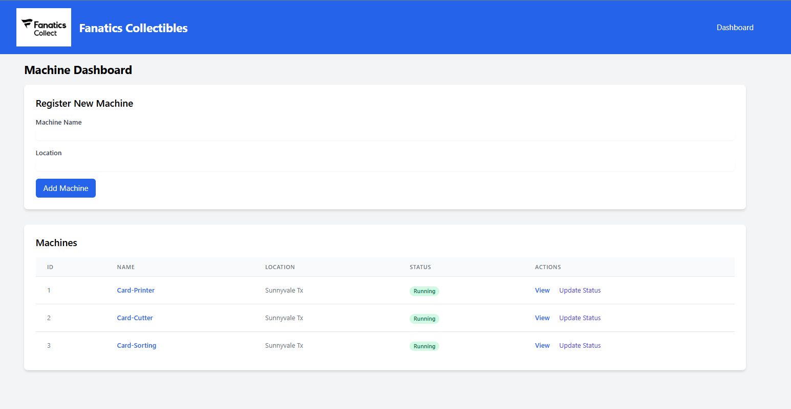

# Fanatics Collectibles Machine Monitoring System

A full-stack application for monitoring and managing automated machinery on the production floor, featuring a FastAPI backend with SQLite database and a modern web interface.

## Features

- **Machine Management**
  - Register new machines with metadata (name, location)
  - Update machine status (idle, running, error, maintenance)
  - View detailed machine information and status history

- **Real-time Monitoring**
  - Interactive dashboard showing all machines and their current status
  - Visual status history with Chart.js graphs
  - Responsive design that works on desktop and mobile

- **RESTful API**
  - Fully documented API endpoints
  - JSON-based communication
  - Data validation and error handling

## Tech Stack

- **Backend**: FastAPI (Python 3.8+)
- **Database**: SQLite (with SQLAlchemy ORM)
- **Frontend**: HTML5, CSS3 (Tailwind CSS), JavaScript (Vanilla + Chart.js)
- **Deployment**: Uvicorn ASGI server

## Setup

### Prerequisites

- Python 3.8 or higher
- pip (Python package manager)
- Node.js (for frontend asset management, optional)

### Installation

1. **Clone the repository**
   ```bash
   git clone <repository-url>
   cd fanatics-collectibles
   ```

2. **Create and activate a virtual environment**
   ```bash
   # Windows
   python -m venv venv
   .\venv\Scripts\activate
   ```

3. **Install Python dependencies**
   ```bash
   pip install -r requirements.txt
   ```

4. **Set up environment variables**
   ```bash
   cp .env.example .env
   # Edit .env file if needed
   ```

## Running the Application

### Development Mode

```bash
# Start the development server with auto-reload
uvicorn app.main:app --reload
```

The application will be available at [http://localhost:8000](http://localhost:8000)


## Web Interface



The web interface provides a user-friendly way to interact with the system:

- **Dashboard**: View all machines and their current status
- **Machine Details**: See detailed information and status history for each machine
- **Status Updates**: Update machine status with a single click
- **Charts**: Visual representation of status history

Access the web interface at [http://localhost:8000](http://localhost:8000) after starting the server.

## API Documentation

Interactive API documentation is available at [http://localhost:8000/docs](http://localhost:8000/docs) when running the application.

### Available Endpoints

- `GET /` - Web interface dashboard
- `GET /machines/{id}` - Machine details page
- `GET /api/machines` - List all machines (JSON)
- `POST /api/machines` - Create a new machine
- `GET /api/machines/{id}` - Get machine details (JSON)
- `POST /api/machines/{id}/status` - Update machine status

## Database

The application uses SQLite by default for simplicity. The database file (`fanatics.db`) will be created automatically on first run.


## Testing

Run the test suite with:

```bash
pytest
```

## Deployment

For production deployment, consider:

1. Using a production-grade ASGI server (e.g., Uvicorn with Gunicorn)
2. Setting up a proper database (PostgreSQL recommended for production)
3. Configuring environment variables for production settings
4. Setting up HTTPS with a reverse proxy (Nginx, Apache)
5. Implementing proper authentication and authorization

## License

This project is licensed under the MIT License - see the [LICENSE](LICENSE) file for details.

## Contributing

1. Fork the repository
2. Create your feature branch (`git checkout -b feature/descriptoin`)
3. Commit your changes (`git commit -m 'Add some Feature'`)
4. Push to the branch (`git push origin feature/AmazingFeature`)
5. Open a Pull Request
